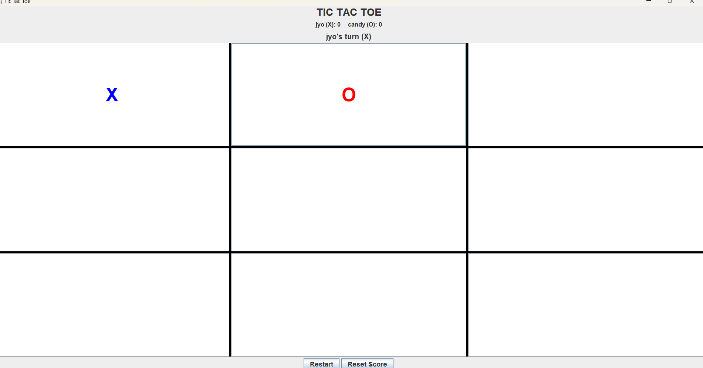
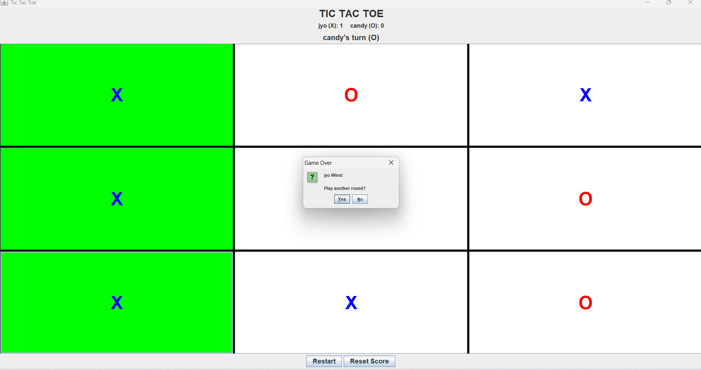

# Tic Tac Toe Game 🎮

A console-based Tic Tac Toe game developed using Java.

## Features

- Two player mode
- Player name support
- Input validation
- Winner detection
- Draw detection
- Replay option

## Technologies Used

- Java
- 2D Arrays
- Methods
- Loops
- Conditional Statements

## Concepts Implemented

- Array traversal
- Boolean logic
- Game state management
- User input handling

## How to Run

1. Clone the repository
2. Open the project in VS Code
3. Run TicTacToe.java

## Screenshots

### Game Start

### Winner Screen

